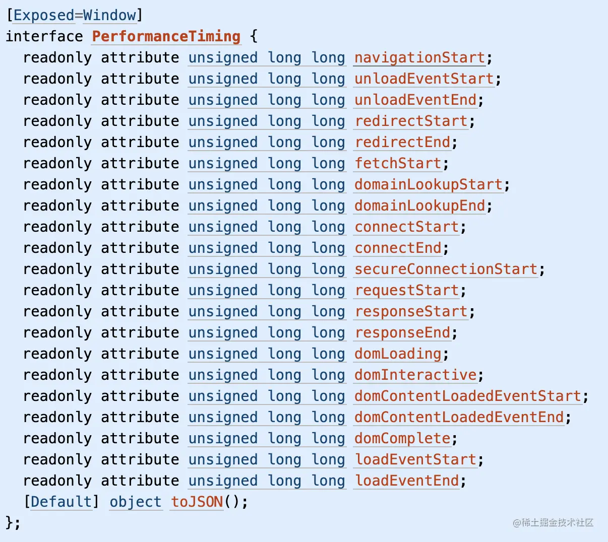

用户访问业务的过程：
1. 页面生产时（服务器端状态）
2. 页面加载时
3. 页面运行时

监控：
- 错误监控  
  - 业务代码错误
  - 接口错误
  - 框架错误
  - 这些错误大多会导致页面功能异常甚至白屏
- 性能监控
  - 页面加载时间
  - 接口响应时间
  - 这些会直接影响用户的使用体验 

前端异常：
1. JS代码异常：`window.onerror`可以捕获js的全局错误，需要写在js脚本的最前面，需要返回true，避免异常继续上抛，打印到控制台
2. promise异常：catch中单独处理，通过全局的`unhandledrejection`监听
3. 框架异常
4. 静态资源加载异常：资源加载的错误不会冒泡到window上，不能被onerror函数捕获，可以通过`window.addEventListener`来获取
5. AJAX请求异常：重写`XMLHttpRequest`方法，监听所有请求。类似axios请求库，可以通过拦截器实现监听
6. 跨域`Script Error`: 浏览器由于安全原因屏蔽了第三方的错误信息

## 页面性能：
- 常见方案是通过`performance.timing`API获取；
- 最新的浏览器提供了更高API等级的`performance.getEntriesByType(`navigation`)`API；
- 降级方案则为手动计算关键时间并上报


```javascript
let t = window.performance.timing;

//TTFB 读取页面第一个字节的时间
times.ttfbTime = t.responseStart - t.navigationStart;

//白屏时间
times.blankTime = (t.domInteractive || t.domLoading) - t.fetchStart;

//首屏时间
times.domReadyTime = t.domContentLoadedEventEnd - t.fetchStart;
```

上报数据
- 传统方式是使用img标签（不存在跨域问题，且兼容性好）,弊端，如在卸载文档时进行上报，浏览器会延迟卸载以保证图片能正常加载，会影响页面性能，可能会丢失部分日志
- `navigator.sendBeacon`:数据可靠，浏览器关闭请求照样能发，异步执行，不会影响下一页面的加载，使用简单

```javascript
window.addEventListener('unload',logData,false);
function logData(){
  navigator.senBeacon('/log', analyticsData);
}
```


参考：
https://juejin.cn/post/6939703198739333127
https://zhuanlan.zhihu.com/p/433408114